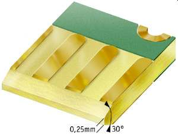

# CMM2 Expansion Card Mouse Joy
 
 
 
 

This card adds following functionalities to CMM2: USB mouse (HT chip) including wireless, Atari joystick, Nunchuk port

Schematic can be found here: [schematic REV A v03](/Schematic/mouse_j_REVA_v03.pdf)

Expansion system and cards can be purchased here: [PS Labs](https://sklep.pslabs.pl/Maximite-c91)


1. USB A connector for mouse
2. DB9 for Atari Joystick
3. HT USB mouse host chip
4. Power supply selector

# WARNING!

Expansion card have to have edges chamfered, using unchamfered card will result in slot damage.

# Assembly
1. Install U1 DIP28 socket
2. Cut goldpin headers with pliers to correct length and install J1, J4
3. Install J2 USB A socket
4. Install J3 DB9 socket
5. Install USB HT Chip in socket. WARNING! Make sure that orientation is correct and pins are straight
6. Install jumpers on J4 (described in chapter Power supply selector)

# Power supply selector
Use J4 to select from what power source card should be powered:
PM. - power from power module card
CMM - power from Maximite-c91

Example:


Never connect power from different sources:


# Connecting Nunchuk controller
Nunchuk plug should be connected as shown below, connecting differently will cause short on 3.3V rail.


# Atari joystick pinout and code example code
In table below You can find pinout for Atari Joystick DB9 socket:

| DB9 pin | Function | Maximite IDC40 pin |
| --- | --- | --- |
| 1 | UP | 35 |
| 2 | DOWN | 36 |
| 3 | LEFT | 38 |
| 4 | RIGHT | 40 |
| 5 | nc | nc |
| 6 | BUTTON A | 32 |
| 7 | +5V | +5V |
| 8 | GND | GND |
| 9 | BUTTON B | 33 |

Code example can be found below:

```basic
SETPIN 35, DIN, PULLUP
SETPIN 36, DIN, PULLUP
SETPIN 38, DIN, PULLUP
SETPIN 40, DIN, PULLUP
SETPIN 32, DIN, PULLUP

DO
  IF PIN(35) = 0 THEN PRINT"UP"
  IF PIN(36) = 0 THEN PRINT"DOWN"
  IF PIN(38) = 0 THEN PRINT"LEFT"
  IF PIN(40) = 0 THEN PRINT"RIGT"
  IF PIN(32) = 0 THEN PRINT"FIRE"
  PAUSE 100
LOOP
```


# Mouse sample code
Below You can find sample code for mouse test using HT chip

```basic
mode 3
gui cursor on
controller mouse open 2,leftclick,rightclick
settick 20, myint
do:loop
'
sub myint
  gui cursor mouse(x,2),mouse(y,2)
end sub
'
sub leftclick
  static integer n
  local integer x=mouse(x,2),y=mouse(y,2)
  gui cursor off
  gui cursor on 1,x,y,rgb(red)
  n=n+1
  print @(100,100)"left",n
  end sub
'
sub rightclick
  static integer n=0
  local integer x=mouse(x,2),y=mouse(y,2)
  gui cursor off
  gui cursor on 0,x,y
  n=n+1
  print @(200,100)"Right",n
end sub
```